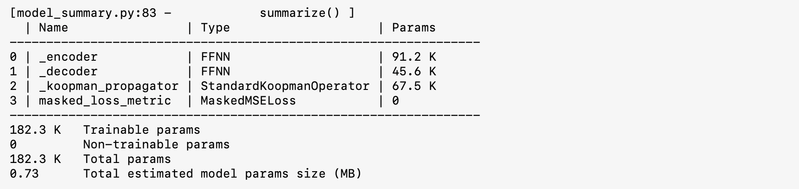

# Poincaré Flow Neural Network: Learning Chaos In A Linear Way

This is the implementation of the paper Poincaré Flow Neural Network: Learning Chaos In A Linear Way.

Learning long-term behaviors in chaotic dynamical systems, such as turbulent flows and climate modelling, is challenging due to their inherent instability and unpredictability. These systems exhibit positive Lyapunov exponents, which significantly hinder accurate long-term forecasting. As a result, understanding long-term statistical behavior is far more valuable than focusing on short-term accuracy. While autoregressive deep sequence models have been applied to capture long-term behavior, they often lead to exponentially increasing errors in learned dynamics. To address this, we shift the focus from simple prediction errors to preserving an invariant measure in dissipative chaotic systems. These systems have attractors, where trajectories settle, and the invariant measure is the probability distribution on attractors that remains unchanged under dynamics. Existing methods generate long trajectories of dissipative chaotic systems by aligning invariant measures, but it is not always possible to obtain invariant measures for arbitrary datasets. We propose the Poincaré Flow Neural Network (PFNN), a novel operator learning framework designed to capture behaviors of chaotic systems without any explicit knowledge on the invariant measure.
PFNN employs an auto-encoder to map the chaotic system to a finite dimensional feature space, effectively linearizing the chaotic evolution.
It then learns the linear evolution operators to match the physical dynamics by addressing two critical properties in dissipative chaotic systems: (1) contraction, the system’s convergence toward its attractors, and (2) measure invariance, trajectories on the attractors following a probability distribution invariant to the dynamics.
Our experiments on a variety of chaotic systems, including Lorenz 96, Kuramoto-Sivashinsky equation and Navier–Stokes equation, demonstrate that PFNN has more accurate predictions and physical statistics compared to competitive baselines including the Fourier Neural Operator and the Markov Neural Operator.

Table of contents
=================

* [Updates for ICLR 2025 Rebuttal Session.](#updates-for-iclr-2025-rebuttal-session)
  * [Update to Reviewer pS8g: New Illustration of Contraction Constraint Effects on Operator and Results on Scaling PFNN to Dimension 256x256 NS Resolution](#update--new-illustration-of-contraction-constraint-effects-on-operator-and-results-on-scaling-pfnn-to-dimension-256x256-ns-resolution-suggested-by-reviewer-ps8g)
  * [Update to Reviewer GyXm: Training Parameters and New Results of Wall Clock Time of Predictions ](#update--new-results-suggested-by-reviewer-gyxm)
  * [Update to Reviewer CMhA: New Echo State Network (ESN) Results (a non-official implementation due to lack of offical open source)](#update--new-echo-state-network-esn-results-suggested-by-reviewer-cmha)
* [Dissipative Chaotic Systems State Forecasting Expresso](#dissipative-chaotic-systems-state-forecasting-expresso)
  * [Lorenz 96 (1D, Dimension 80)](#lorenz-96-1d-dimension-80)
  * [KS (1D, Dimension128)](#ks-1d-dimension128)
  * [Kolmogorov Flow (2D, Dimension 64 $\times$ 64)](#kolmogorov-flow-2d-dimension-64-x-64)

## **Updates for ICLR 2025 Rebuttal Session.**
### **Update ! New Illustration of Contraction Constraint Effects on Operator and Results on Scaling PFNN to Dimension 256x256 NS Resolution Suggested by Reviewer pS8g**

#### (1) An illustrative eigenvalues/physical contraction plots of the trained operators

| Fig.1 The eigenvalues plot of non-PFNN constrained operator,<br />PFNN-contraction constrained operator $G_c$,<br />and PFNN-measure-invariant constrained operator $G_m$<br /> on the task Lorenz96 (Dimension=80). | Fig.2 The eigenvalues plot of non-PFNN constrained operator,<br />PFNN-contraction constrained operator $G_c$ <br />and PFNN-measure-invariant constrained operator $G_m$ <br />on the task KS (Dimension=128). |
| :-----------------------------------------------------------------------------------------------------------------------------------------------------------------------------------------------------------------------: | :------------------------------------------------------------------------------------------------------------------------------------------------------------------------------------------------------------------: |
|                                                                                                                                                  |                                                                                                                                                      |

**Fig.3 Contraction in physical vector field - A visualization of PFNN_contraction model prediction on Lorenz 63 system:**

<div style="display: flex; justify-content: space-between; align-items: flex-start; font-family: Arial, sans-serif; line-height: 1.5;">
  <!-- XY Field -->
  <div style="flex: 1; margin-right: 10px; text-align: center;">
    
    <figcaption style="margin-top: 10px; font-size: 14px;">XY Field</figcaption>
  </div>
  <!-- XZ Field -->
  <div style="flex: 1; margin-right: 10px; text-align: center;">
    
    <figcaption style="margin-top: 10px; font-size: 14px;">XZ Field</figcaption>
  </div>
  <!-- YZ Field -->
  <div style="flex: 1; text-align: center;">
    
    <figcaption style="margin-top: 10px; font-size: 14px;">YZ Field</figcaption>
  </div>
</div>

#### (2) Scaling PFNN to more challenging and higher dimensional 2D Kolmogorov Flow

**Fig.1 Short-Term prediction**

<div style="width: 100%; display: table;">
  <div style="display: table-row;">
    <div style="display: table-cell; text-align: center; width: 33%;">
      <h6 style="font-size: 18px;">Ground Truth</h6>
      
    </div>
    <div style="display: table-cell; text-align: center; width: 33%;">
      <h6 style="font-size: 18px;">PFNN Prediction</h6>
      
    </div>
    <div style="display: table-cell; text-align: center; width: 33%;">
      <h6 style="font-size: 18px;">Absolute Error</h6>
      
    </div>
  </div>
</div>

**Fig.2 Long-term invariant statistics**

<div style="width: 100%; display: table;">
  <div style="display: table-row;">
    <div style="display: table-cell; text-align: center; width: 49%;">
      <h6 style="font-size: 18px;">Truth and Error of TKE</h6>
      
    </div>
    <div style="display: table-cell; text-align: center; width: 49%;">
      <h6 style="font-size: 18px;">Truth and Error of Mean State</h6>
      
    </div>
  </div>
</div>

### **Update ! New Results Suggested by Reviewer GyXm**

#### **(1) Trainable paprameters of baselines and PFNN modules**.

We post a concise table to help the reviewer to percieve **how many parameters are used for learning tasks from low dimensional chaos to high dimensional one.**

| System         | DenseNet  | Koopman   | LSTM      | MNO       | PFNN (Contract) | PFNN (Consist) |
| -------------- | --------- | --------- | --------- | --------- | --------------- | -------------- |
| Lorenz63 (m=3) | 114,303   | 182,253   | 18,078   | 114,303   | 114,153         | 117,073        |
| System         | FNO  | Koopman   | LSTM      | MNO       | PFNN (Contract) | PFNN (Consist) |
| NS (m=64x64)   | 4,507,489 | 7,653,630 | 7,873,444 | 4,877,289 | 4,425,826       | 4,746,264      |

**Example of Koopman (from pykoopman) baseline model structure for Lorenz 63 system.**



#### **(2) Computation Complexity and Wall Clock time for baselines and PFNN predictions.**

**(2-1)** This section provides a comparison of the computational complexity of **LSTM**, **Koopman Autoencoder**, and **Fourier Neural Operator (FNO)** for a **single forward pass** for **one-time prediction**. The analysis includes **gate units** and **matrix multiplication** complexities.

<!-- **Notation**

- **Input Dimension** $d$
- **Hidden Units / Latent Dimension** $h$
- **Grid Size** $N$ for FNO
- **Number of Layers** $L$
- **Number of Blocks** $M$ for LSTM blocks, Fourier blocks in MNO
- **Sequence Length** $T$

**Complexity Comparison Table**

| Method                                  | Computation Complexity         |
| --------------------------------------- | ------------------------------ |
| **LSTM**                          | $ O(4MTdh + 4MTh^2)$         |
| **Koopman Operator**              | $ O(2Tdh + (L-2)Th^2)$       |
| **Fourier Neural Operator (FNO)** | $ O(MTN\log N + TMd^2 N)$    |
| **Markov Neural operator (MNO)**  | $ O(MTN\log N + TMd^2 N)$    |
| **PFNN**                          | $ O(2Tdh + (L-2)Th^2 + h^3)$ |
|				|				|

**Summary**

- **LSTM**:
  Each of the four LSTM gates (input, forget, output, candidate) requires computations proportional to $d*h + h^2$.
- **Koopman Operator**:
  Each typically consists of $L-2$ layers with operations scaling as $O((L-2)h^2)$ and encoder/dercoder with complexity $O(2dh)$.
- **FNO/MNO**:
  The computation complexity of FFT is $O(N\log N)$ and matrix multiplication $d^2 N$.
- **PFNN**:
  Each typically consists of $L-2$ layers with operations scaling as $O((L-2)h^2)$, encoder/dercoder with complexity $O(2Tdh)$ and eigendecomposition $O(h^3)$ at the worst case. -->

<div style="display: flex; justify-content: space-between; align-items: flex-start; font-family: Arial, sans-serif; line-height: 1.5;">
  <!-- Notation Block -->
  <div style="flex: 1; margin-right: 20px; max-width: 30%;">
    <h2 style="margin-bottom: 10px;">Notation</h2>
    <ul style="list-style-type: disc; padding-left: 20px; margin: 0;">
      <li><strong>Input Dimension</strong> <em>d</em></li>
      <li><strong>Hidden Units / Latent Dimension</strong> <em>h</em></li>
      <li><strong>Grid Size</strong> <em>N</em> for FNO</li>
      <li><strong>Number of Layers</strong> <em>L</em></li>
      <li><strong>Number of Blocks</strong> <em>M</em> for LSTM blocks, Fourier blocks in MNO</li>
      <li><strong>Sequence Length</strong> <em>T</em></li>
    </ul>
  </div>
  <!-- Complexity Comparison Table -->
  <div style="flex: 1; margin-right: 20px; max-width: 40%;">
    <h2 style="margin-bottom: 10px;">Complexity Comparison Table</h2>
    <table style="width: 100%; border-collapse: collapse;">
      <tr>
        <th style="text-align: left; padding: 8px; border: 1px solid #ccc;">Method</th>
        <th style="text-align: left; padding: 8px; border: 1px solid #ccc;">Computation Complexity</th>
      </tr>
      <tr>
        <td style="padding: 8px; border: 1px solid #ccc;">LSTM</td>
        <td style="padding: 8px; border: 1px solid #ccc;">O(4MTdh + 4MTh²)</td>
      </tr>
      <tr>
        <td style="padding: 8px; border: 1px solid #ccc;">Koopman Operator</td>
        <td style="padding: 8px; border: 1px solid #ccc;">O(2Tdh + (L-2)Th²)</td>
      </tr>
      <tr>
        <td style="padding: 8px; border: 1px solid #ccc;">Fourier Neural Operator (FNO)</td>
        <td style="padding: 8px; border: 1px solid #ccc;">O(MTNlogN + TMd²N)</td>
      </tr>
      <tr>
        <td style="padding: 8px; border: 1px solid #ccc;">Markov Neural Operator (MNO)</td>
        <td style="padding: 8px; border: 1px solid #ccc;">O(MTNlogN + TMd²N)</td>
      </tr>
      <tr>
        <td style="padding: 8px; border: 1px solid #ccc;">PFNN</td>
        <td style="padding: 8px; border: 1px solid #ccc;">O(2Tdh + (L-2)Th² + h³)</td>
      </tr>
    </table>
  </div>
  <!-- Summary Block -->
  <div style="flex: 1; max-width: 30%;">
    <h2 style="margin-bottom: 10px;">Summary</h2>
    <ul style="list-style-type: disc; padding-left: 20px; margin: 0;">
      <li><strong>LSTM:</strong> Each of the four LSTM gates (input, forget, output, candidate) requires computations proportional to <em>d*h + h²</em>.</li>
      <li><strong>Koopman Operator:</strong> Each typically consists of <em>L-2</em> layers with operations scaling as <em>O((L-2)h²)</em> and encoder/decoder complexity <em>O(2dh)</em>.</li>
      <li><strong>FNO/MNO:</strong> The computation complexity of FFT is <em>O(NlogN)</em> and matrix multiplication is <em>d²N</em>.</li>
      <li><strong>PFNN:</strong> Each typically consists of <em>L-2</em> layers with operations scaling as <em>O((L-2)h²)</em>, encoder/decoder complexity <em>O(2Tdh)</em>, and eigendecomposition <em>O(h³)</em> at the worst case.</li>
    </ul>
  </div>

</div>

**(2-2)** We post a concise table to show **how many seconds each model uses to predict 100 steps for a typical medium dimensional chaos system**. (Data run *for 10 rounds resulting in mean used time and standard deviations*)

<div style="display: flex; align-items: center;">
  <div style="flex: 1; margin-right: 20px;">
    <table>
      <thead>
        <tr>
          <th>Model</th>
          <th>Mean Time (seconds)</th>
          <th>Std Time (seconds)</th>
        </tr>
      </thead>
      <tbody>
        <tr>
          <td>FNO</td>
          <td>0.354292</td>
          <td>0.040446</td>
        </tr>
        <tr>
          <td>LSTM</td>
          <td>0.401461</td>
          <td>0.015888</td>
        </tr>
        <tr>
          <td>Koopman</td>
          <td>0.575717</td>
          <td>0.01633</td>
        </tr>
        <tr>
          <td>MNO</td>
          <td>0.461298</td>
          <td>0.020641</td>
        </tr>
        <tr>
          <td>PFNN_contract</td>
          <td>0.422275</td>
          <td>0.016096</td>
        </tr>
        <tr>
          <td>PFNN_consist</td>
          <td>0.435978</td>
          <td>0.013612</td>
        </tr>
      </tbody>
    </table>
    <p><em>Table: Wall Clock Time for models prediction 100 steps on L96 (Dimension = 80) Task</em></p>
  </div>
  <div style="flex: 1; text-align: center;">
    
    <p><em>Figure: Wall Clock Time for models prediction 100 steps on L96 (Dimension = 80) Task</em></p>
  </div>
</div>


### **Update ! [New Echo State Network (ESN) Results](./ESN_Lorenz63_KS.ipynb) Suggested by Reviewer CMhA**

Check the code notebook url for further details. This is a non-official implementation of ESN. Please credit to repository *pyESN* for the contribution to fill in the gap. The authors are also waiting for the official code from the reviewer provided references.

Here's a quick preview of the results of the PyTorch version of pyESN:

<div style="display: flex; justify-content: space-between; align-items: flex-start; font-family: Arial, sans-serif; line-height: 1.5;">
  <!-- Column 1: ESN on Lorenz 63 -->
  <div style="flex: 1; margin-right: 20px; max-width: 48%;">
    <h2 style="margin-bottom: 10px;">(1) ESN model performance on Lorenz 63 state forecasting task</h2>
    
  </div>
  <!-- Column 2: ESN on KS -->
  <div style="flex: 1; max-width: 48%;">
    <h2 style="margin-bottom: 10px;">(2) ESN model performance on KS state forecasting task</h2>
    
  </div>
</div>

## Dissipative Chaotic Systems State Forecasting Expresso

### Lorenz 96 (1D, Dimension 80)


### Kuramoto-Sivashinsky (1D, Dimension128)


### Kolmogorov Flow (2D, Dimension 64 $\times$ 64)

Model performance in short-term forecasting accuracy in absolute error with states at step $\{2, 4, 8, 16, 32\}$.

<div style="width: 100%; display: table;">
  <div style="display: table-row;">
    <div style="display: table-cell; text-align: center; width: 34%;">
      <h6 style="font-size: 12px;">Ground Truth</h6>
      
    </div>
    <div style="display: table-cell; text-align: center; width: 34%;">
      <h6 style="font-size: 12px;">PFNN Prediction</h6>
      
    </div>
    <div style="display: table-cell; text-align: center; width: 34%;">
      <h6 style="font-size: 12px;">Absolute Error</h6>
      
    </div>
  </div>
</div>

## Install and dependence

In the beginning, simply try to clone the repository.

Then, create the enviroment for PFNN via

```
conda env create -f environment.yml
conda activate PFNN
```
