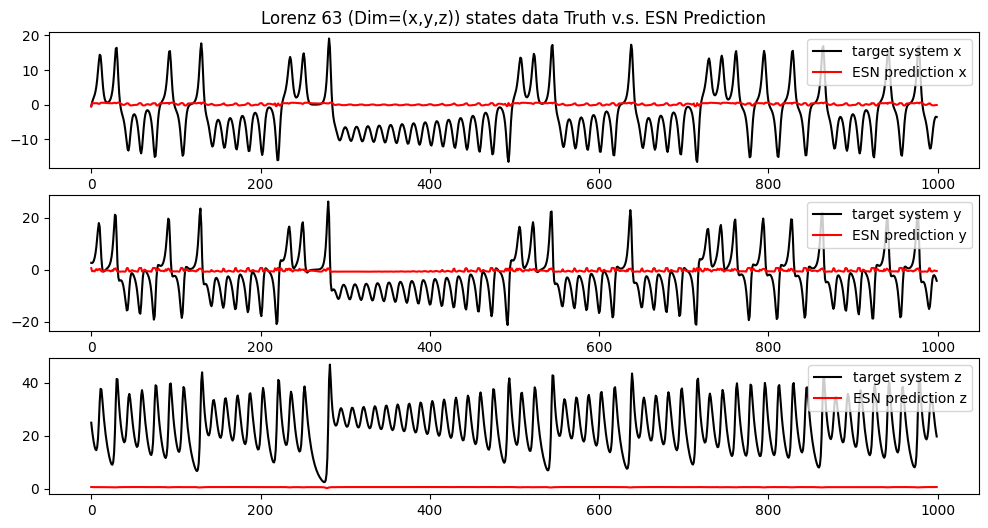
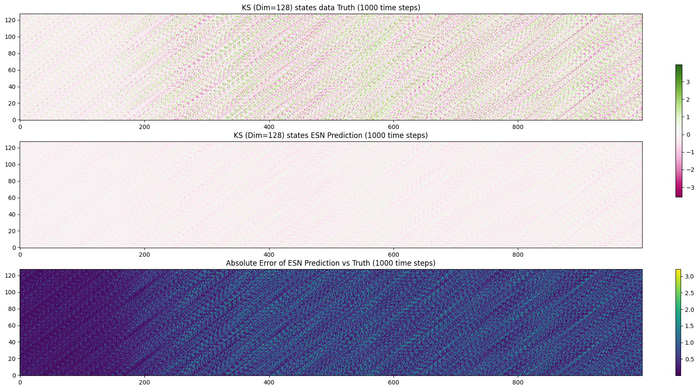
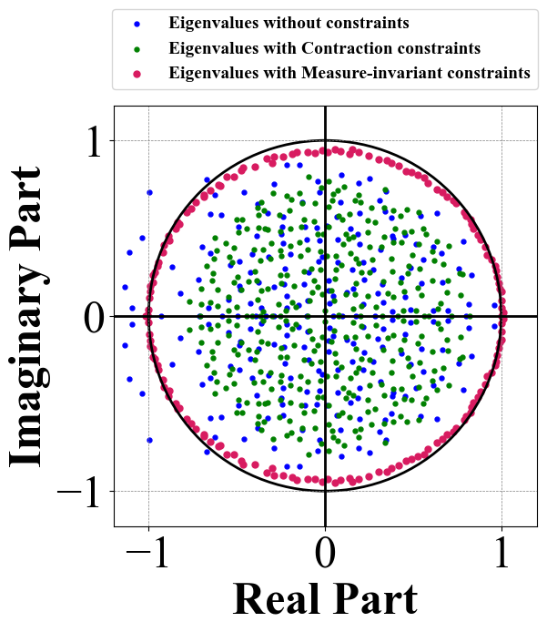
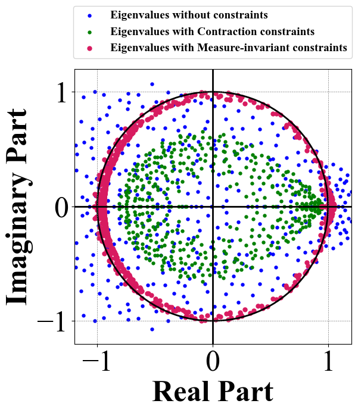
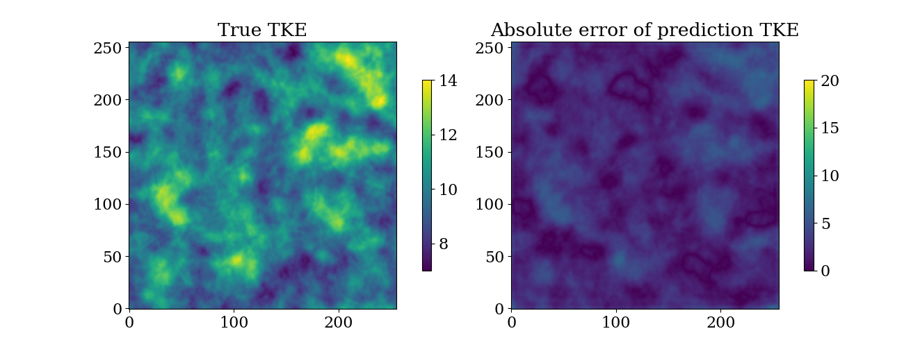
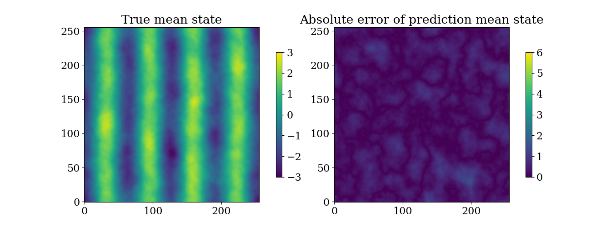
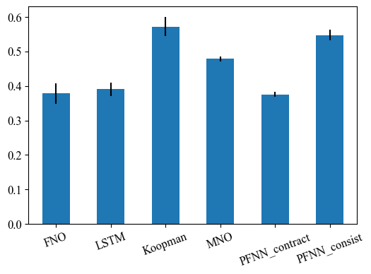

# Poincaré Flow Neural Network: Learning Chaos In A Linear Way

This is the implementation of the paper Poincaré Flow Neural Network: Learning Chaos In A Linear Way.

Learning long-term behaviors in chaotic dynamical systems, such as turbulent flows and climate modelling, is challenging due to their inherent instability and unpredictability. These systems exhibit positive Lyapunov exponents, which significantly hinder accurate long-term forecasting. As a result, understanding long-term statistical behavior is far more valuable than focusing on short-term accuracy. While autoregressive deep sequence models have been applied to capture long-term behavior, they often lead to exponentially increasing errors in learned dynamics. To address this, we shift the focus from simple prediction errors to preserving an invariant measure in dissipative chaotic systems. These systems have attractors, where trajectories settle, and the invariant measure is the probability distribution on attractors that remains unchanged under dynamics. Existing methods generate long trajectories of dissipative chaotic systems by aligning invariant measures, but it is not always possible to obtain invariant measures for arbitrary datasets. We propose the Poincaré Flow Neural Network (PFNN), a novel operator learning framework designed to capture behaviors of chaotic systems without any explicit knowledge on the invariant measure.
PFNN employs an auto-encoder to map the chaotic system to a finite dimensional feature space, effectively linearizing the chaotic evolution.
It then learns the linear evolution operators to match the physical dynamics by addressing two critical properties in dissipative chaotic systems: (1) contraction, the system’s convergence toward its attractors, and (2) measure invariance, trajectories on the attractors following a probability distribution invariant to the dynamics.
Our experiments on a variety of chaotic systems, including Lorenz 96, Kuramoto-Sivashinsky equation and Navier–Stokes equation, demonstrate that PFNN has more accurate predictions and physical statistics compared to competitive baselines including the Fourier Neural Operator and the Markov Neural Operator.

Table of contents
=================

* [Updates for ICLR 2025 Rebuttal Session.](#updates-for-iclr-2025-rebuttal-session)
  * [Update to Reviewer CMhA: New Echo State Network (ESN) Results](#update--new-echo-state-network-esn-results-suggested-by-reviewer-cmha)
  * [Update to Reviewer pS8g: New Illustration of Contraction Constraint Effects on Operator and Results on Scaling PFNN to Dimension 256x256 NS Resolution](#update--new-illustration-of-contraction-constraint-effects-on-operator-and-results-on-scaling-pfnn-to-dimension-256x256-ns-resolution-suggested-by-reviewer-ps8g)
  * [Update to Reviewer GyXm: New Results of Wall Clock Time of Predictions Suggested by Reviewer GyXm](#update--new-results-suggested-by-reviewer-gyxm)
* [Dissipative Chaotic Systems State Forecasting Expresso](#dissipative-chaotic-systems-state-forecasting-expresso)
  * [Lorenz 96 (1D, Dimension 80)](#lorenz-96-1d-dimension-80)
  * [KS (1D, Dimension128)](#ks-1d-dimension128)
  * [Kolmogorov Flow (2D, Dimension 64 $\times$ 64)](#kolmogorov-flow-2d-dimension-64-x-64)

## **Updates for ICLR 2025 Rebuttal Session.**

### **Update ! [New Echo State Network (ESN) Results](./ESN_Lorenz63_KS.ipynb) Suggested by Reviewer CMhA**

Check the code notebook url for further details. Here's a quick preview of the results:

#### (1) ESN model performance on Lorenz 63 state forecasting task



#### (2) ESN model performance on KS state forecasting task



### **Update ! New Illustration of Contraction Constraint Effects on Operator and Results on Scaling PFNN to Dimension 256x256 NS Resolution Suggested by Reviewer pS8g**

#### (1) An illustrative eigenvalues plots of the operators trained with different constraints

<!-- (1) The eigenvalues plot of non-PFNN constrainted operator, PFNN-contraction constrainted operator $G_c$ and PFNN-measure-invariant constrainted operator $G_m$ on task Lorenz96 (Dimension=80).


(2) The eigenvalues plot of non-PFNN constrainted operator, PFNN-contraction constrainted operator $G_c$ and PFNN-measure-invariant constrainted operator $G_m$ on task Lorenz96 (Dimension=80).
 -->

| (1) The eigenvalues plot of non-PFNN constrained operator, PFNN-contraction constrained operator $G_c$ and PFNN-measure-invariant constrained operator $G_m$ on the task Lorenz96 (Dimension=80). | (2) The eigenvalues plot of non-PFNN constrained operator, PFNN-contraction constrained operator $G_c$ and PFNN-measure-invariant constrained operator $G_m$ on the task KS (Dimension=128). |
| :--------------------------------------------------------------------------------------------------------------------------------------------------------------------------------------------------: | :---------------------------------------------------------------------------------------------------------------------------------------------------------------------------------------------: |
|                                                                                                                            |                                                                                                                                  |

#### (2) Scaling PFNN to more challenging and higher dimensional 2D Kolmogorov Flow

**Short-Term prediction**

<div style="width: 100%; display: table;">
  <div style="display: table-row;">
    <div style="display: table-cell; text-align: center; width: 33%;">
      <h6 style="font-size: 18px;">Ground Truth</h6>
      
    </div>
    <div style="display: table-cell; text-align: center; width: 33%;">
      <h6 style="font-size: 18px;">PFNN Prediction</h6>
      
    </div>
    <div style="display: table-cell; text-align: center; width: 33%;">
      <h6 style="font-size: 18px;">Absolute Error</h6>
      
    </div>
  </div>
</div>

**Long-term invariant statistics**

<div style="width: 100%; display: table;">
  <div style="display: table-row;">
    <div style="display: table-cell; text-align: center; width: 49%;">
      <h6 style="font-size: 18px;">Truth and Error of TKE</h6>
      
    </div>
    <div style="display: table-cell; text-align: center; width: 49%;">
      <h6 style="font-size: 18px;">Truth and Error of Mean State</h6>
      
    </div>
  </div>
</div>

### **Update ! New Results Suggested by Reviewer GyXm**

Wall clock time for baseline and PFNN predictions. (Running for 10 times resulting in mean used time and standard deviations)

<div style="display: flex; align-items: center;">
  <div style="flex: 1; margin-right: 20px;">
    <table>
      <thead>
        <tr>
          <th>Model</th>
          <th>Mean Time (seconds)</th>
          <th>Std Time (seconds)</th>
        </tr>
      </thead>
      <tbody>
        <tr>
          <td>FNO</td>
          <td>0.007735</td>
          <td>0.000919</td>
        </tr>
        <tr>
          <td>LSTM</td>
          <td>0.005702</td>
          <td>0.000214</td>
        </tr>
        <tr>
          <td>Koopman</td>
          <td>0.015555</td>
          <td>0.000269</td>
        </tr>
        <tr>
          <td>MNO</td>
          <td>0.007597</td>
          <td>0.000773</td>
        </tr>
        <tr>
          <td>PFNN_contract</td>
          <td>0.009644</td>
          <td>0.000306</td>
        </tr>
        <tr>
          <td>PFNN_consist</td>
          <td>0.007097</td>
          <td>0.000215</td>
        </tr>
      </tbody>
    </table>
    <p><em>Table: Wall Clock Time for models prediction 100 steps on L96 (Dimension = 80) Task</em></p>
  </div>
  <div style="flex: 1; text-align: center;">
    
    <p><em>Figure: Wall Clock Time for models prediction 100 steps on L96 (Dimension = 80) Task</em></p>
  </div>
</div>

## Dissipative Chaotic Systems State Forecasting Expresso

### Lorenz 96 (1D, Dimension 80)


### KS (1D, Dimension128)


### Kolmogorov Flow (2D, Dimension 64 $\times$ 64)

Model performance in short-term forecasting accuracy in absolute error with states at step $\{2, 4, 8, 16, 32\}$.

<div style="width: 100%; display: table;">
  <div style="display: table-row;">
    <div style="display: table-cell; text-align: center; width: 34%;">
      <h6 style="font-size: 12px;">Ground Truth</h6>
      
    </div>
    <div style="display: table-cell; text-align: center; width: 34%;">
      <h6 style="font-size: 12px;">PFNN Prediction</h6>
      
    </div>
    <div style="display: table-cell; text-align: center; width: 34%;">
      <h6 style="font-size: 12px;">Absolute Error</h6>
      
    </div>
  </div>
</div>

## Install and dependence

In the beginning, simply try to clone the repository.

Then, create the enviroment for PFNN via

```
conda env create -f environment.yml
conda activate PFNN
```
